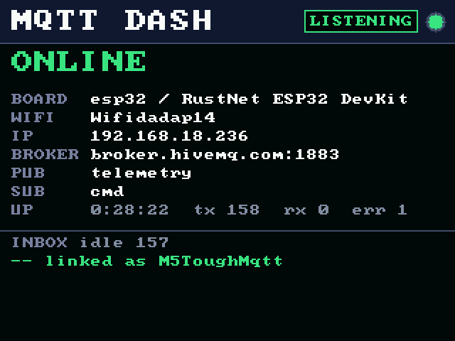
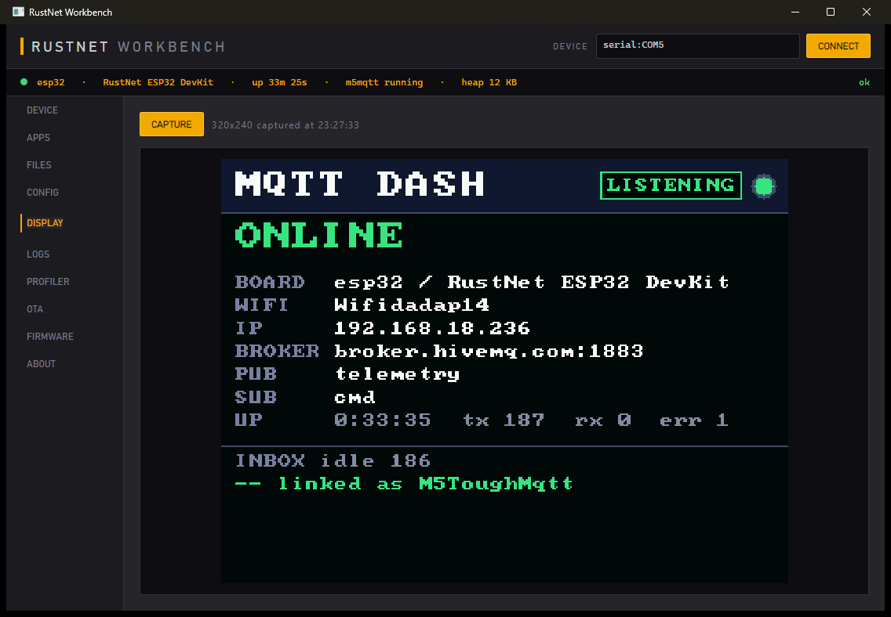
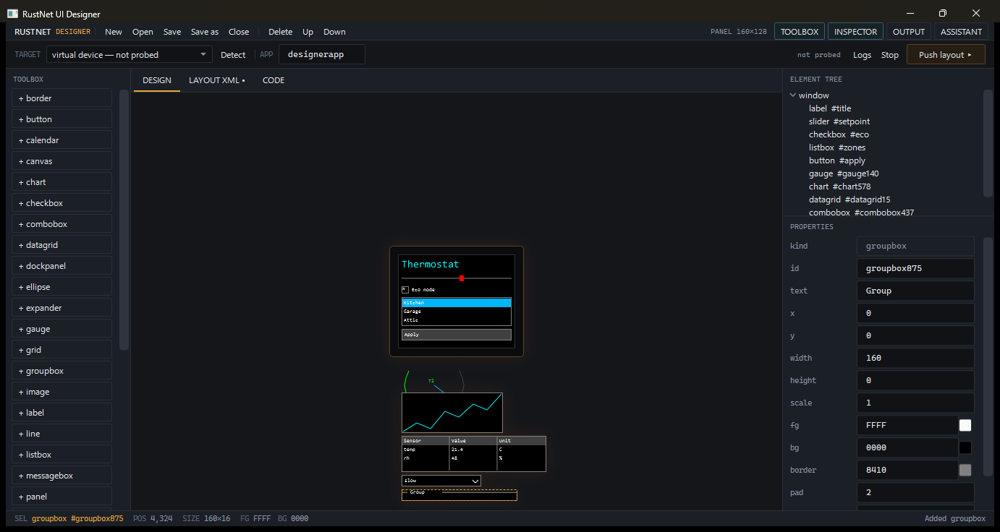

# RustNet

**.NET di mikrokontroler, ditenagai runtime Rust.**

*English: [README.md](README.md)*

RustNet menjalankan aplikasi C#/.NET di MCU (ESP32, ESP32-C3 & K210
RISC-V, STM32, TI, NXP) di atas runtime yang ditulis dalam Rust demi
keamanan memori dan performa — DNA dari TinyCLR (tooling & konfigurasi) +
nanoFramework (IoT & open source) + Meadow (.NET modern), di atas fondasi
yang lebih kokoh.

```
Aplikasi C# ──dotnet build──▶ DLL ──MetadataProcessor──▶ .rnx ──sign(RSA)──▶ RNSB
                                                                             │
      Protokol RNDP (TCP / USB-CDC / UART)                                   ▼
Tools (CLI ▪ Workbench ▪ VSCode) ◀──────────────▶ Firmware (Rust) ─▶ Interpreter IL
                                                     │ HAL ▪ FS ▪ Net ▪ Gfx ▪ OTA
```

## Tampilannya

Aplikasi C# yang berjalan di M5Stack Tough — perangkatnya sendiri yang
menggambar ini, dan gambarnya diambil dari papan lewat protokol yang sama
dengan yang dipakai perkakasnya:



**Workbench** menyiapkan papan, mem-flash aplikasi ke dalamnya, dan mengawasi
apa yang dikerjakannya. Baris pembacaan di atas menunjukkan perangkat yang
sedang tersambung; panel di bawahnya adalah layar papan itu sendiri:



**Designer** menyusun layar memakai perender perangkat yang sebenarnya, jadi
apa yang Anda seret sama dengan apa yang digambar papan:



## Mulai cepat (tanpa perangkat keras)

```bash
# 1. Build semuanya
cargo build -p rustnet-firmware
dotnet build dotnet/RustNet.slnx

# 2. Jalankan virtual device (firmware sungguhan, RNDP lewat TCP)
./target/debug/rustnet-firmware --ephemeral

# 3. Di terminal lain: provisioning, buat aplikasi, flash, jalankan
alias rustnet=./dotnet/tools/RustNet.Cli/bin/Debug/net10.0/rustnet
rustnet keys generate --out keys
rustnet provision --key keys/rustnet-signing.pub
rustnet new datalogger-db AppSaya && cd AppSaya
RUSTNET_SDK=.. dotnet build
rustnet flash bin/Debug/net10.0/AppSaya.dll --name appsaya --key ../keys/rustnet-signing.key --start
rustnet logs --follow
rustnet io                      # snapshot I/O langsung (pin, bus, antarmuka jaringan)
rustnet display capture -o layar.ppm
```

Atau pakai GUI (`dotnet run --project dotnet/tools/RustNet.Workbench`),
atau **Simulator Panel** di ekstensi VSCode (tampilan display + GPIO +
log secara langsung).

## Yang didapat aplikasi C#

- **C# modern**: try/catch/finally, lambda & delegate, `List`/`Dictionary`
  + foreach, LINQ, string interpolation, StringBuilder, Regex, thread,
  subset Task, timer — lihat [docs/dotnet-support.md](docs/dotnet-support.md)
- **Bus industri**: CAN, Modbus master RTU/TCP, 1-Wire —
  [docs/protocols.md](docs/protocols.md)
- **Jaringan**: WiFi, Ethernet, PPP, Seluler + HTTP/MQTT —
  [docs/networking.md](docs/networking.md)
- **Database SQL** di flash/SD/USB atau in-memory —
  [docs/database.md](docs/database.md)
- **Layanan sistem**: sleep/wake (GPIO & alarm RTC), shutdown/reset, RTC,
  watchdog, memori eksternal QSPI/SDRAM, info perangkat, kontrol sinyal
  ala TinyCLR — [docs/system.md](docs/system.md)
- **Serializer**: JSON / XML / biner + stream —
  [docs/serialization.md](docs/serialization.md)
- **Pustaka UI**: pohon elemen ala WPF/Glide, layout XML, dirender ke
  display perangkat — [docs/ui.md](docs/ui.md)

## Tata letak repositori

| Path | Isi |
|---|---|
| `runtime/` | Workspace Rust: HAL + simulator, interpreter IL + GC, scheduler, kripto, secure boot, OTA, FS, jaringan (+Modbus), database SQL, grafika, USB, firmware |
| `dotnet/src/` | Pustaka kelas C# (`RustNet.Hal`, `RustNet.Buses`, `RustNet.Net`, `RustNet.Data`, `RustNet.Serialization`, `RustNet.UI`, `RustNet.IO`, `RustNet.Devices`, ...) |
| `dotnet/tools/` | MetadataProcessor (DLL→RNX), pustaka Deploy (TCP/serial), CLI `rustnet`, Workbench Avalonia |
| `dotnet/tests/` | Suite xunit termasuk dua aplikasi E2E (matriks lengkap C# → RNX → firmware → interpreter) |
| `templates/` | 10 template aplikasi (`rustnet new <template> <Nama>`) |
| `vscode-extension/` | Integrasi VSCode (flash, log, profiler, display, panel simulator) |
| `docs/` | Arsitektur, memulai, protokol + panduan per fitur |

## Status & roadmap

Semua yang di atas berjalan hari ini di virtual device dan tercakup suite
test (175 test Rust + 44 test .NET, termasuk tiga matriks fitur end-to-end).
C# modern kini lengkap (inheritance/interface/virtual dispatch, async/await,
generics pengguna, filter `catch when`). Milestone yang sedang berjalan:
bring-up silikon nyata — C# sudah jalan di bare-metal ARM, di ESP32, dan
sejak 2026-07-31 di **bare-metal RISC-V 64-bit**, di mana aplikasi
bertanda tangan yang dikirim lewat kabel bertahan melewati power cycle,
menyimpan file di SPI NOR board, dan menganimasikan panel 320×240 pada
sekitar 20 fps. Lihat
[PLAN.md](PLAN.md) untuk roadmap dan [Progress.md](Progress.md) untuk
checklist perkembangan. Panduan bring-up chip: [docs/chips.md](docs/chips.md).
Langkah demi langkah deploy aplikasi:
[ESP32-WROOM-32](docs/deploy-esp32.id.md) ·
[M5Stack Tough](docs/deploy-m5tough.id.md) (panel 320×240 hidup) ·
[Netduino 3 WiFi](docs/deploy-netduino3.id.md) (C# di bare-metal ARM) ·
[Sipeed Maix Go](docs/deploy-maixgo.id.md) (C# di bare-metal RISC-V, dengan
grafis dan filesystem).

## Kredit

Dibuat oleh **Gravicode Studios**, dipimpin oleh **Kang Fadhil**.
