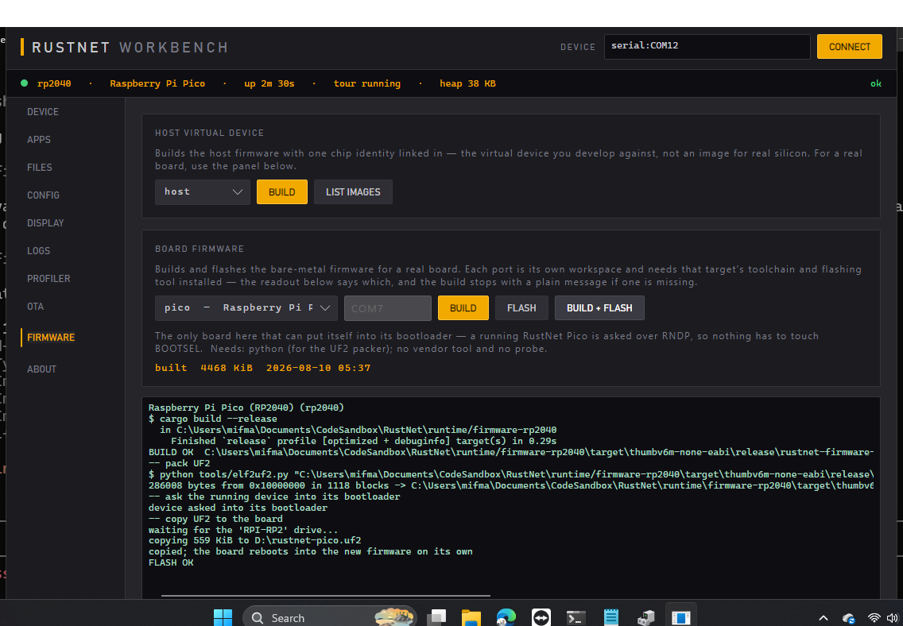

# RustNet

**.NET on microcontrollers, powered by a Rust runtime.**

[](https://www.nuget.org/packages/RustNet)

*Bahasa Indonesia: [README.id.md](README.id.md)*

RustNet runs C#/.NET applications on MCUs (ESP32, ESP32-C3 & K210 RISC-V,
STM32, TI, NXP) on top of a runtime written in Rust for memory safety and
performance — the DNA of TinyCLR (tools & config) + nanoFramework (IoT &
open source) + Meadow (modern .NET), on a stronger foundation.

```
C# app ──dotnet build──▶ DLL ──MetadataProcessor──▶ .rnx ──sign(RSA)──▶ RNSB
                                                                        │
      RNDP protocol (TCP / USB-CDC / UART)                              ▼
Tools (CLI ▪ Workbench ▪ VSCode) ◀──────────────▶ Firmware (Rust) ─▶ IL interpreter
                                                     │ HAL ▪ FS ▪ Net ▪ Gfx ▪ OTA
```

## What it looks like

A C# application running on an M5Stack Tough — the device drew this itself,
and the picture came off the board over the same protocol the tools use:


**Workbench** provisions a board, flashes applications to it, and watches what
they do. The readout across the top is whichever device is on the other end of
the cable; the panel below is its own screen, captured live:


It also builds and flashes the *firmware* for any board here, calling that
target's own toolchain. A Raspberry Pi Pico is the extreme case: asked over
RNDP to reboot into its ROM bootloader, it reflashes itself with nobody
touching BOOTSEL.



**Designer** lays out a screen against the device's real renderer, so what you
drag is what the board draws — the same layout code runs in both:


## Quick start (no hardware needed)

```bash
# 1. Build everything
cargo build -p rustnet-firmware
dotnet build dotnet/RustNet.slnx

# 2. Start the virtual device (a real firmware, RNDP over TCP)
./target/debug/rustnet-firmware --ephemeral

# 3. In another terminal: provision, create an app, flash, run
alias rustnet=./dotnet/tools/RustNet.Cli/bin/Debug/net10.0/rustnet
rustnet keys generate --out keys
rustnet provision --key keys/rustnet-signing.pub
rustnet new datalogger-db MyApp && cd MyApp
RUSTNET_SDK=.. dotnet build
rustnet flash bin/Debug/net10.0/MyApp.dll --name myapp --key ../keys/rustnet-signing.key --start
rustnet logs --follow
rustnet io                      # live I/O snapshot (pins, buses, netifs)
rustnet display capture -o screen.ppm
```

Or use the GUI (`dotnet run --project dotnet/tools/RustNet.Workbench`) or
the VSCode extension's **Simulator Panel** (live display + GPIO + logs).

## The managed API, from NuGet

Step 3 above resolves `RustNet.*` out of this checkout through `RUSTNET_SDK`,
which is what you want while working on the framework itself. An application
that only *uses* it takes the package instead:

```bash
dotnet add package RustNet
```

One package, sixteen assemblies — `RustNet.Hal`, `RustNet.Net`,
`RustNet.Graphics`, `RustNet.UI` and the rest. They are thin `[InternalCall]`
façades that the interpreter resolves by canonical name on the device, so they
version together and there is nothing to pick between.

```csharp
using RustNet.Hal;
using RustNet.Threading;

Gpio.SetMode(2, PinMode.Output);
while (true) { Gpio.Toggle(2); Sleep.Ms(500); }
```

The tools stay where they are: `rustnet flash` still turns that into a signed
module and puts it on the board.

## What C# apps get

- **Modern C#**: inheritance & interfaces with real virtual dispatch,
  async/await, user generics, try/catch/finally + `catch when` filters,
  lambdas & delegates, `List`/`Dictionary` + foreach, LINQ, string
  interpolation, StringBuilder, Regex, threads, timers —
  see [docs/dotnet-support.md](docs/dotnet-support.md)
- **Field buses**: CAN, Modbus RTU/TCP master, 1-Wire —
  [docs/protocols.md](docs/protocols.md)
- **Networking**: WiFi, Ethernet, PPP, Cellular + HTTP/MQTT —
  [docs/networking.md](docs/networking.md)
- **SQL database** on flash/SD/USB or in-memory —
  [docs/database.md](docs/database.md)
- **System services**: sleep/wake (GPIO & RTC), shutdown/reset, RTC,
  watchdog, QSPI/SDRAM external memory, device info, TinyCLR-style signal
  control — [docs/system.md](docs/system.md)
- **Serializers**: JSON / XML / binary + streams —
  [docs/serialization.md](docs/serialization.md)
- **UI toolkit**: WPF/Glide-style element tree, XML layouts, rendered to
  the device display — [docs/ui.md](docs/ui.md)
- **UI Designer + AI assistant**: draw a screen, or have "Jack The Code
  Bender" design it and write the app code — [docs/designer.md](docs/designer.md),
  [docs/assistant.md](docs/assistant.md)

## Repository layout

| Path | What |
|---|---|
| `runtime/` | Rust workspace: HAL + simulator, IL interpreter + GC, scheduler, crypto, secure boot, OTA, FS, networking (+Modbus), SQL database, graphics, USB, firmware |
| `dotnet/src/` | C# class libraries (`RustNet.Hal`, `RustNet.Buses`, `RustNet.Net`, `RustNet.Data`, `RustNet.Serialization`, `RustNet.UI`, `RustNet.IO`, `RustNet.Devices`, ...) |
| `dotnet/tools/` | MetadataProcessor (DLL→RNX), Deploy library (TCP/serial), `rustnet` CLI, Avalonia Workbench, UI Designer (WPF **and** Avalonia, over a shared `Designer.Core`) with the Semantic-Kernel code assistant |
| `dotnet/tests/` | xunit suite incl. two E2E apps (full C# → RNX → firmware → interpreter matrix) |
| `templates/` | 10 app templates (`rustnet new <template> <Name>`) |
| `vscode-extension/` | VSCode integration (flash, logs, profiler, display, simulator panel) |
| `docs/` | Architecture, getting started, protocol + per-feature guides |
| `.github/workflows/` | CI and the NuGet release ([docs/publishing.md](docs/publishing.md)) — belongs at the *monorepo root* |

## Status & roadmap

Everything above runs today on the virtual device and is covered by the
test suites (175 Rust + 44 .NET tests, including three end-to-end feature
matrices). Real-silicon bring-up is the current milestone: C# runs on
bare-metal ARM, on the ESP32, and — since 2026-07-31 — on bare-metal
64-bit RISC-V, where a signed app flashed over the wire survives a power
cycle, keeps files in the board's SPI NOR, and animates a 320×240 panel at
around 20 fps. See [PLAN.md](PLAN.md) for the roadmap and
[Progress.md](Progress.md) for the live checklist. Chip bring-up guide:
[docs/chips.md](docs/chips.md).
Deploying an app, step by step: [ESP32-WROOM-32](docs/deploy-esp32.md) ·
[Seeed XIAO ESP32C3](docs/deploy-xiao-c3.md) (RNDP over the SoC's own USB
Serial/JTAG, no bridge chip) ·
[M5Stack Core2](docs/deploy-m5core2.md) (live 320×240 panel) ·
[M5Stack Tough](docs/deploy-m5tough.md) (live 320×240 panel) ·
[Netduino 3 WiFi](docs/deploy-netduino3.md) (C# on bare-metal ARM) ·
[Meadow F7 Micro](docs/deploy-meadow-f7.md) (Cortex-M7 at 216 MHz, RNDP over
the board's own USB) ·
[Sipeed Maix Go](docs/deploy-maixgo.md) (C# on bare-metal RISC-V, with
graphics and a filesystem) ·
[Raspberry Pi Pico](docs/deploy-pico.md) (RNDP over the board's own USB — no
serial adapter, no probe, and it reflashes itself).

## Credits

Made by **Gravicode Studios**, led by **Kang Fadhil**.
