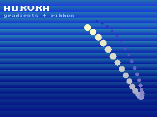

# Deploying a C# App to an M5Stack Core2

The Core2 is a Tough with a different case: the same ILI9342C 320×240 panel on
the same SPI pins, behind the same AXP192 PMIC. So this is the short
version — [`deploy-m5tough.md`](deploy-m5tough.md) covers everything the two
boards share, and what follows is only what differs.

Verified on hardware (COM14): firmware flashed, panel driven, a C# graphics
demo rendering on it, and the tools reaching the board while it draws.



## Build and flash

```bash
rustnet firmware build --board m5core2
rustnet firmware flash --board m5core2 --port COM14
```

Or the panel in the Workbench: **FIRMWARE ▸ BOARD FIRMWARE**, pick `m5core2`,
enter the port, BUILD + FLASH. By hand it is
`cargo build --release --features board-m5core2`, then `espflash` **with
`--partition-table partitions.csv`** — without it there is no FAT storage
partition and nothing survives a reboot.

## The one rail that is not the Tough's

**LDO3 drives the vibration motor on a Core2.** The Tough's bring-up powers it
at 3.0 V and enables it, which on a Core2 means the board buzzes from the
moment it boots until it is switched off. The display would come up perfectly
and the board would still be wrong.

So `m5_axp192_init` splits exactly that: on a Core2 LDO3 is left at its lowest
setting and its enable bit in register 0x12 is never set. Everything else —
LDO2 for the LCD rail, DCDC3 for the backlight, the GPIO4 reset pulse — is
shared, because it is genuinely the same hardware.

`rustnet info` reports `m5stack-core2 (esp-idf)` in the log banner, so there is
never a question about which image is on the board.

## The demo, and what it is for

`runtime/firmware-esp32/demo/Core2Showcase` is a three-scene graphics demo:
drifting gradient bands with a Lissajous ribbon, a wireframe cube and
octahedron rotating on different axes, and a chart of the demo's **own frame
times**, measured as it runs.

It is deliberately not the Maix Go showcase again. That one asked whether a
panel could be driven at all. This panel already works, so the question here is
what the interpreter can sustain — hence the self-measuring third scene. A demo
that reports its own frame rate cannot flatter itself.

Two things it demonstrates by construction:

**Calls per frame is the budget, not pixels.** A host call crosses from
interpreted IL into Rust and costs far more than the drawing it requests.
Twenty `FillGradient` bands cover the whole screen for twenty calls; the same
area as rectangles would take hundreds and look flatter, because the gradient
is interpolated on the Rust side where a per-pixel loop is free. There is not
one `SetPixel` in the demo.

**A drawing loop must stand aside.** Presenting a 320×240 frame holds the board
while it streams to the panel, and the firmware's RNDP service needs the same
board to answer anything. Drawing flat out left the demo looking perfect and
the device unreachable — `info` timed out, `logs` timed out, and only
`apps stop`, squeezed into the moment after a reset, got it back. The board had
never crashed: its uptime was seven minutes. `Present` now sleeps 25 ms, which
caps the demo near 30 fps and leaves the service loop the room it visibly
needs.

```bash
cd runtime/firmware-esp32/demo/Core2Showcase && dotnet build
rustnet provision --key keys/rustnet-signing.pub --device serial:COM14
rustnet flash bin/Debug/net10.0/Core2Showcase.dll --name showcase \
    --key keys/rustnet-signing.key --chip esp32 --device serial:COM14 --start
rustnet apps stop --device serial:COM14      # the demo loops; this ends it
```

> Array initialisers are the one thing to know before writing your own:
> `int[] xs = { 1, 2, 3, 4 };` compiles to `ldtoken` of a data field, which
> this runtime does not support and the MetadataProcessor refuses by name.
> Assign the elements, or derive them — the demo builds both of its solids from
> their structure instead, which says what the shape *is* where a list of
> numbers only says where its corners ended up.

## Capturing the screen

```bash
rustnet display capture screen.ppm --device serial:COM14
```

Two caveats, both real and both seen here. A 320×240 RGB frame is 230 KB, and
at 115200 baud that is roughly **twenty seconds** — a second command issued
during the transfer collides with it, which looks exactly like a dead board.
And the capture is a snapshot of the framebuffer taken whenever it arrives, so
stopping an app to freeze a scene can catch it **half drawn**: the demo's
second scene captured as its background gradient alone, before the wireframe
went down.
